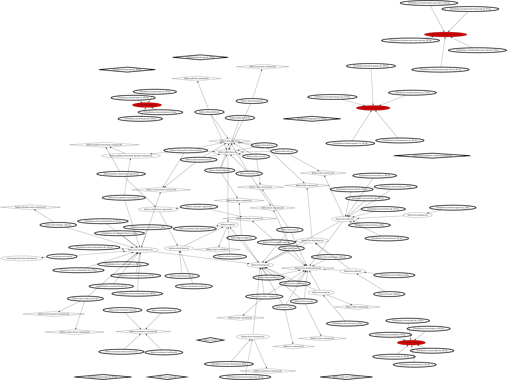

# fedora-blueprints

This is an **experimental** repository to try how Fedora Editions and Spins could be defined in [osbuild-composer](https://github.com/osbuild/osbuild-composer)'s blueprint format and what problems need to be solved to make this feasible.

## Usage

Install the Packit-built RPMs for the [following PR](x):

```
copr enable ...
dnf install osbuild-composer composer-cli
```

Build the blueprints you want:

```
composer-cli blueprints push blueprints/*
composer-cli compose start blueprint iso-live
```

## Format

Generally the blueprints (found in [blueprints/](blueprints/)) are much shorter than their kickstart counterparts. That is because in `osbuild-composer` a lot of work is handled by the `image type`. It's also notable that package lists [have no excludes](https://github.com/osbuild/osbuild-composer/issues/3535) and there is [no inheritance](https://github.com/osbuild/osbuild-composer/issues/3537). Both these subjects are still under discussion for inclusion in `osbuild-composer`.

## Extras

This repository comes with a bunch of extras to make figuring out the kickstarts, their includes, the package sets, and other things a bit easier for myself. You can find these scripts in `scripts/`.

### Graph Kickstart includes

`scripts/ksu.py` offers a way to generate graphviz `.dot` files of the kickstarts and their includes:

```
€ scripts/ksu.py graph external/fedora-kickstarts > figures/kickstart-graph.dot 
€ dot -Ksfdp -Tpng -Goverlap=false figures/kickstart-graph.dot > figures/kickstart-graph.png

# Optional
€ xdg-open figures/kickstart-graph.png
```

The resulting image looks like:


